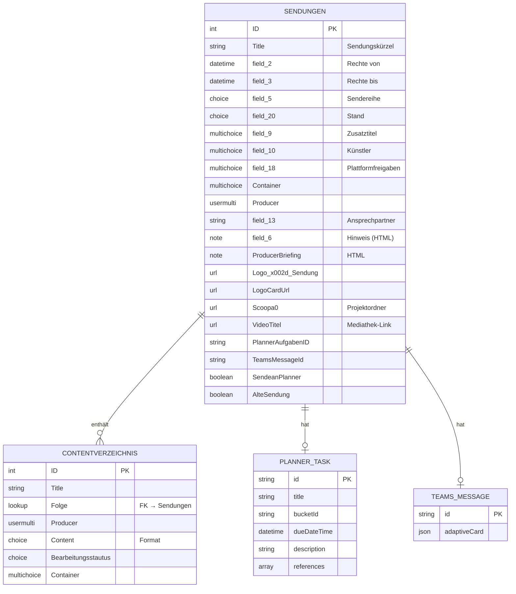
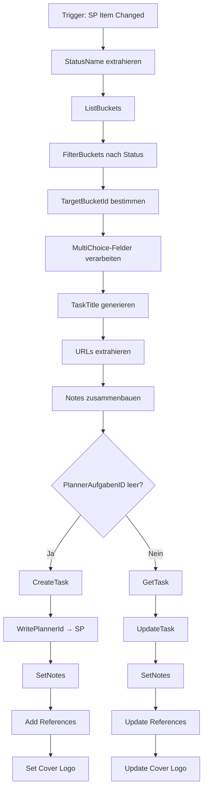
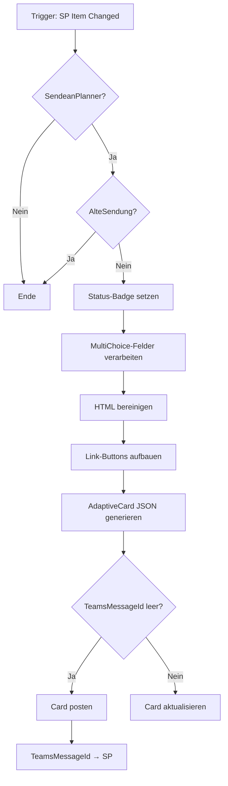
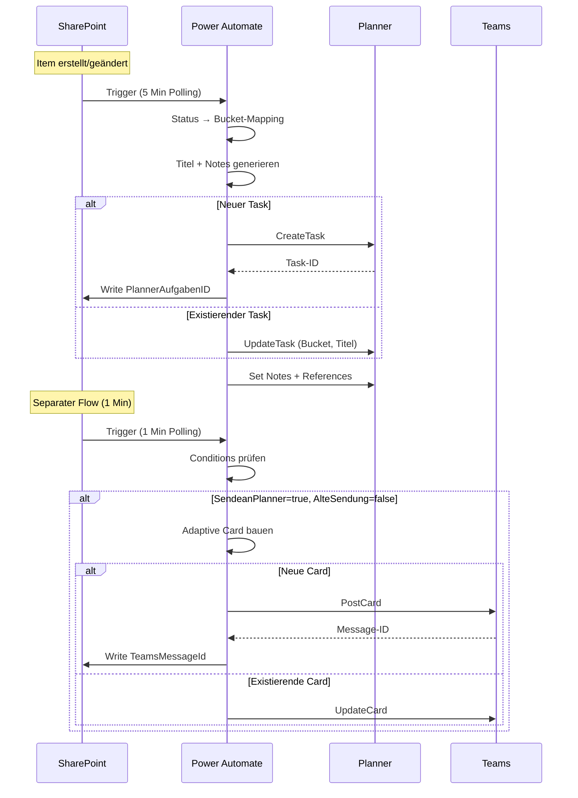

# ARD Stand-Up – System-Architektur

## Überblick

Das ARD Stand-Up System automatisiert das Content-Management für die ARD-weite Comedy-Marke. Es verbindet SharePoint (Datenhaltung), Planner (Task-Management) und Teams (Benachrichtigungen) zu einem integrierten Workflow.

```
┌─────────────────────────────────────────────────────────────────────────┐
│                           WDR Microsoft 365 Tenant                      │
├─────────────────────────────────────────────────────────────────────────┤
│                                                                         │
│   ┌──────────────┐        ┌──────────────┐        ┌──────────────┐     │
│   │  SharePoint  │        │    Planner   │        │    Teams     │     │
│   │              │        │              │        │              │     │
│   │ ┌──────────┐ │        │ ┌──────────┐ │        │ ┌──────────┐ │     │
│   │ │Sendungen │◄├────────┼─┤  Tasks   │ │        │ │ Channel  │ │     │
│   │ └──────────┘ │        │ └──────────┘ │        │ │ Cards    │ │     │
│   │      ▲       │        │      ▲       │        │ └──────────┘ │     │
│   │      │       │        │      │       │        │      ▲       │     │
│   │ ┌──────────┐ │        │      │       │        │      │       │     │
│   │ │Content-  │ │        │      │       │        │      │       │     │
│   │ │verzeichn.│ │        │      │       │        │      │       │     │
│   │ └──────────┘ │        │      │       │        │      │       │     │
│   └──────┬───────┘        └──────┼───────┘        └──────┼───────┘     │
│          │                       │                       │             │
│          └───────────────────────┴───────────────────────┘             │
│                                  │                                     │
│                       ┌──────────┴──────────┐                          │
│                       │    Power Automate   │                          │
│                       │                     │                          │
│                       │  Flow 1: → Planner  │                          │
│                       │  Flow 2: → Teams    │                          │
│                       └─────────────────────┘                          │
│                                                                         │
└─────────────────────────────────────────────────────────────────────────┘
```

## Datenmodell

### Entity-Relationship



### SharePoint-Listen

#### Liste: Sendungen

| InternalName | DisplayName | Typ | Beschreibung |
|--------------|-------------|-----|--------------|
| `ID` | ID | Counter | Primärschlüssel |
| `Title` | Sendungskürzel | Text | z.B. "LN24-01" |
| `field_2` | Rechte von | DateTime | Ausstrahlungsdatum, wird als DueDate verwendet |
| `field_3` | Rechte bis | DateTime | Rechtezeitraum Ende |
| `field_5` | Sendereihe | Choice | z.B. "Ladies Night", "Nightwash" |
| `field_9` | Zusatztitel | MultiChoice | Ergänzende Titel-Infos |
| `field_10` | Künstler | MultiChoice | Comedians in der Sendung |
| `field_13` | Ansprechpartner | Text | Kontaktperson |
| `field_18` | Plattformfreigaben | MultiChoice | TikTok, Instagram, YouTube etc. |
| `field_20` | Stand | Choice | Status der Sendung |
| `field_6` | Hinweis | Note (HTML) | Wichtige Infos für Producer |
| `Container` | Container | MultiChoice | Verpackungsformate |
| `Producer` | Producer | UserMulti | Zugewiesene Producer |
| `ProducerBriefing` | Producer Briefing | Note (HTML) | Arbeitsanweisungen |
| `Logo_x002d_Sendung` | Logo-Sendung | URL | Logo für Planner-Task |
| `LogoCardUrl` | Logo Card URL | URL | Logo für Teams Adaptive Card |
| `Scoopa0` | Scoopa | URL | Link zum Projektordner |
| `VideoTitel` | Video Titel | URL | Mediathek-Link |
| `PlannerAufgabenID` | Planner Aufgaben ID | Text | Referenz zum Planner-Task |
| `TeamsMessageId` | Teams Message ID | Text | Referenz zur Teams-Nachricht |
| `SendeanPlanner` | Sende an Planner | Boolean | Aktiviert Teams-Card-Flow |
| `AlteSendung` | Alte Sendung | Boolean | Excludiert von Teams-Card-Flow |
| `{Link}` | Link | Calculated | SharePoint Item-Link |

#### Status-Werte (field_20)

| Wert | Bedeutung | Planner-Bucket | Teams-Badge |
|------|-----------|----------------|-------------|
| `Nicht begonnen` | Neu angelegt | Nicht begonnen | ⚪ |
| `In Bearbeitung` | Wird produziert | In Bearbeitung | 🔵 |
| `Abnahmebereit` | Zur Freigabe | Abnahmebereit | 🟡 |
| `Fertig` | Abgeschlossen | Fertig | 🟢 |
| `Archiviert` | Abgelegt | - | 🟤 |

## Power Automate Flows

### Flow 1: Sendungen → Planner (Phase 1)

**Zweck**: Synchronisiert SharePoint-Sendungen mit Planner-Tasks

**Trigger-Konfiguration**:
- Typ: SharePoint `GetOnUpdatedItems`
- Site: `https://wdr.sharepoint.com/teams/ARDStand-UpO365`
- Liste: `08c76ffb-e10b-4158-92b5-73a509a221cc`
- Intervall: 5 Minuten
- splitOn: aktiviert (Parallelverarbeitung)

**Planner-Ziel**:
- Group ID: `d248cec5-c1d3-4ff5-9063-464b51e94769`
- Plan ID: `BvxWXWZmdkCDv5ijzP3Lg5YABxSR`

#### Ablaufdiagramm



#### Task-Titel-Format

```
ID: #{ID} | {Sendereihe} - {Zusatztitel} | {Datum}
```

Beispiel: `ID: #42 | Ladies Night - Best of 2024 | 15.03.2025`

- Max. 255 Zeichen (wird gekürzt mit `...`)
- Doppelte Leerzeichen werden bereinigt

#### Notes-Struktur

```
👤 Ansprechpartner: {field_13}

📤 Plattformfreigaben: {field_18 joined}

🎭 Künstler: {field_10 joined}

ℹ️ Wichtige Infos
{field_6 plaintext}

🎯 Producer Briefing
📑 Sendungskürzel: {Title}
🧰 Container: {Container joined}
{ProducerBriefing plaintext}
```

#### Planner-Task-References

| Alias | Feld | Icon |
|-------|------|------|
| 📁 Projektordner | `Scoopa0` | - |
| 📺 Mediathek-Link | `VideoTitel` | - |
| 🔍 Datensatz | `{Link}` | - |
| Logo | `Logo_x002d_Sendung` | Cover-Image |

### Flow 2: Sendungen → Teams Adaptive Card

**Zweck**: Postet/aktualisiert Adaptive Cards im Teams-Channel für Producer-Benachrichtigungen

**Trigger-Konfiguration**:
- Typ: SharePoint `GetOnUpdatedItems`
- Site: `https://wdr.sharepoint.com/teams/ARDStand-UpO365`
- Liste: `08c76ffb-e10b-4158-92b5-73a509a221cc`
- Intervall: 1 Minute
- splitOn: aktiviert
- **Conditions**:
  - `SendeanPlanner = true`
  - `AlteSendung != true`

**Teams-Ziel**:
- Group ID: `d248cec5-c1d3-4ff5-9063-464b51e94769`
- Channel ID: `19:3f67cd94e241472aab55708084e3bce8@thread.tacv2`
- Card Type: `ARDStandUp-ProducerZuweisung`

#### Ablaufdiagramm



#### Adaptive Card Struktur

```
┌─────────────────────────────────────────┐
│ ██████████ Status-Badge ██████████████  │  ← Farbcodiert
├─────────────────────────────────────────┤
│              [LOGO]                     │
├─────────────────────────────────────────┤
│ #42 | Ladies Night - Best of           │
│ 📅 15.03.2025        [Datensatz öffnen] │
├─────────────────────────────────────────┤
│ 👤 Producer: Max Mustermann             │
├─────────────────────────────────────────┤
│ Künstler    │ Ansprechpartner │ Plattf. │
│ Comic A,    │ Petra Müller    │ TikTok, │
│ Comic B     │                 │ Insta   │
├─────────────────────────────────────────┤
│ ⚠️ Hinweis (falls vorhanden)            │
│ Wichtige Info hier...                   │
├─────────────────────────────────────────┤
│ 🎯 Producer Briefing                    │
│ Sendungskürzel: LN24-01                 │
│ Container: Short, Reel                  │
│ Briefing-Text...                        │
├─────────────────────────────────────────┤
│ [Projektordner] [Planner] [Mediathek]   │  ← Dynamisch
└─────────────────────────────────────────┘
```

#### Status-Farben (Container Style)

| Status | Style | Farbe |
|--------|-------|-------|
| Fertig | `good` | Grün |
| Abnahmebereit | `attention` | Gelb/Orange |
| In Bearbeitung | `accent` | Blau |
| Nicht begonnen | `emphasis` | Grau |
| Archiviert | `emphasis` | Grau |

## Datenfluss

### Synchronisations-Matrix



### Rückschreibungen nach SharePoint

| Flow | Feld | Wert |
|------|------|------|
| Sendungen → Planner | `PlannerAufgabenID` | Planner Task-ID |
| Sendungen → Teams | `TeamsMessageId` | Teams Message-ID |

## Technische Details

### HTML-Bereinigung

Beide Flows bereinigen HTML-Felder (`field_6`, `ProducerBriefing`), aber mit unterschiedlichen Methoden:

**Flow 1 (Planner)** – Split/Join-Methode:
```javascript
// 1. HTML-Tags durch Linefeeds ersetzen
replace(replace(..., '<br>', LF), '</div>', LF)

// 2. Auf '<' splitten
split(normalized, '<')

// 3. Jedes Teil: Inhalt nach '>' extrahieren
if(contains(item, '>'), last(split(item, '>')), item)

// 4. Array joinen
join(strippedArr, '')
```

**Flow 2 (Teams)** – Replace-Chain:
```javascript
replace(replace(replace(replace(replace(replace(replace(
  html,
  '<br>', '\n\n'),
  '<br/>', '\n\n'),
  '<br />', '\n\n'),
  '</p>', '\n\n'),
  '</div>', '\n\n'),
  '<p>', ''),
  '<div>', '')
```

**Unterschied**: Flow 1 entfernt alle HTML-Tags vollständig, Flow 2 nur bekannte Block-Tags.

### MultiChoice-Verarbeitung

**Pattern für Array-Extraktion**:
```javascript
// Null-Safety
if(equals(triggerBody()?['field_X'], null), createArray(), array(triggerBody()?['field_X']))

// Values extrahieren (Select)
Select: from field_X → item()?['Value']

// Oder via ForEach + Append
coalesce(item()?['Value'], string(item()))

// Join
join(array, ', ')
```

### IDs und Referenzen

| System | ID-Typ | Format |
|--------|--------|--------|
| SharePoint Sendungen | `ID` | Integer (Counter) |
| SharePoint Liste | GUID | `08c76ffb-e10b-4158-92b5-73a509a221cc` |
| Planner Group | GUID | `d248cec5-c1d3-4ff5-9063-464b51e94769` |
| Planner Plan | ID | `BvxWXWZmdkCDv5ijzP3Lg5YABxSR` |
| Teams Channel | ID | `19:3f67cd94e241472aab55708084e3bce8@thread.tacv2` |
| Planner Task | ID | Alphanumerisch |
| Teams Message | ID | Alphanumerisch |

## Bekannte Einschränkungen

### Race Conditions

Beide Flows triggern auf dieselbe SharePoint-Liste mit Polling-Intervallen:
- Flow 1: 5 Minuten
- Flow 2: 1 Minute

**Risiko**: Bei schnellen Änderungen können Updates sich überschneiden.

**Mitigation**:
- Flow 2 hat kürzeres Intervall für schnellere UI-Updates
- Beide Flows schreiben unterschiedliche Felder zurück (keine Konflikte)

### Planner API Limits

- Task-Titel max. 255 Zeichen
- References werden einzeln hinzugefügt (keine Batch-Operation)
- 5-Sekunden-Delay vor Cover-Set (API-Timing)

### HTML in Adaptive Cards

Adaptive Cards unterstützen kein HTML. Die Bereinigung in Flow 2 ist nicht vollständig – verbleibende Tags wie `<strong>`, `<em>`, `<a>` werden nicht entfernt.

## Erweiterungsmöglichkeiten

1. **Bidirektionale Planner-Sync**: Status-Änderungen in Planner → SharePoint zurückschreiben
2. **Producer-Zuweisung via Teams**: Action.Submit in Adaptive Card → HTTP-Trigger → SharePoint Update
3. **Rechteverlängerungs-Warnungen**: Scheduled Flow prüft `field_3` und sendet Reminder
4. **Fehlerbehandlung**: Try-Catch-Pattern mit Scope + Configure Run After

---

*Dokumentation erstellt: 2026-01-22*
*Basierend auf Flow-Exporten vom 2026-01-22*
