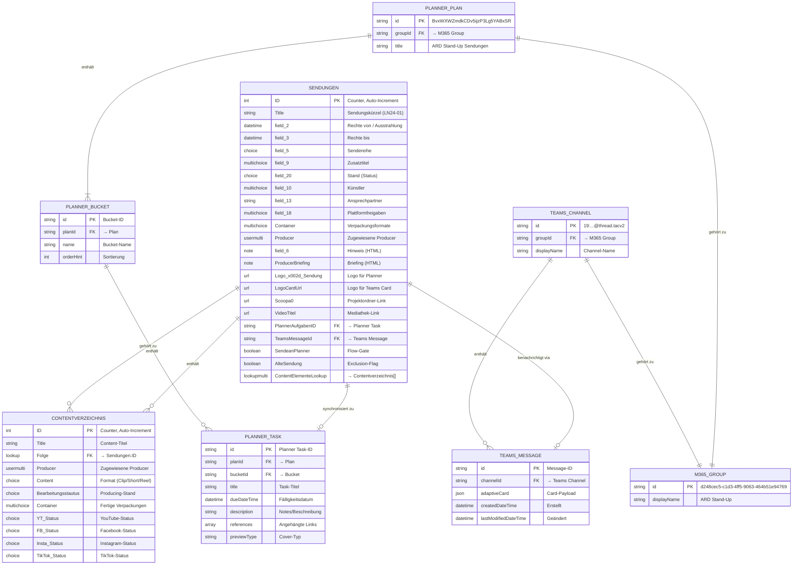
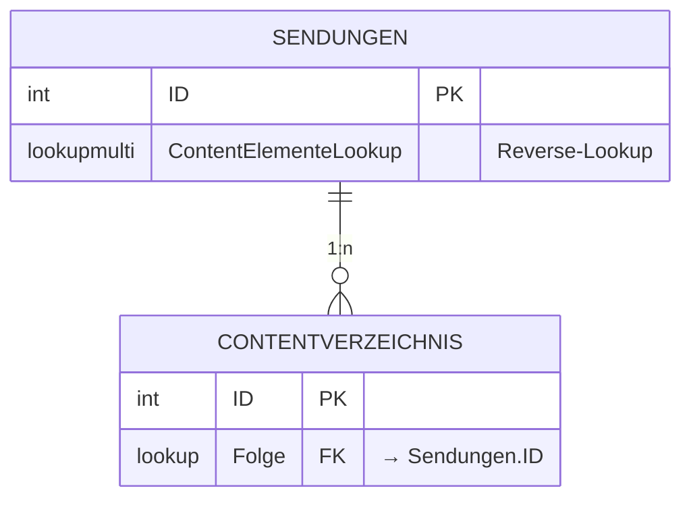
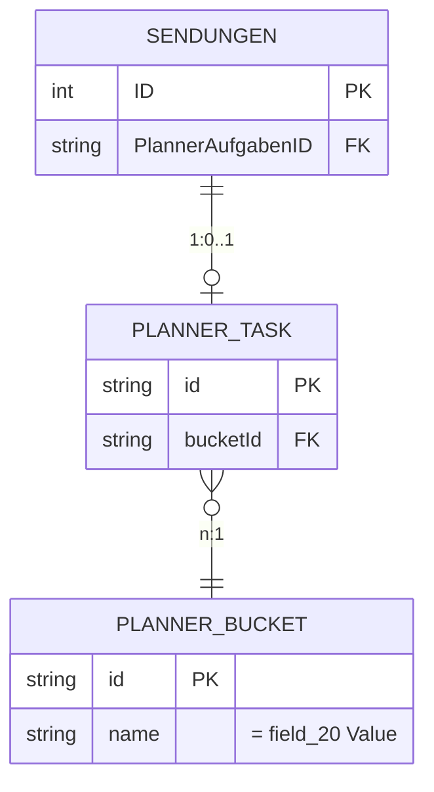
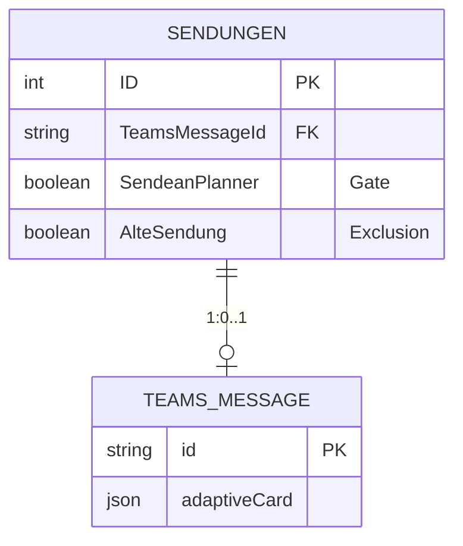
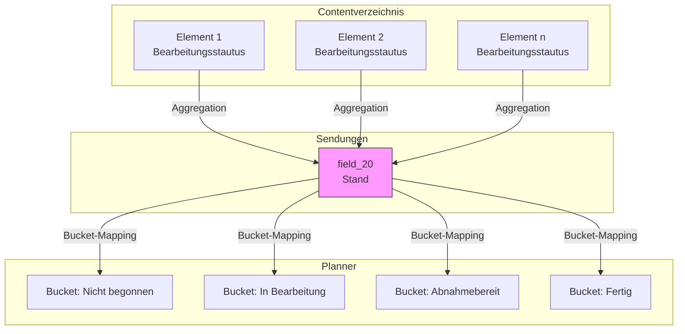
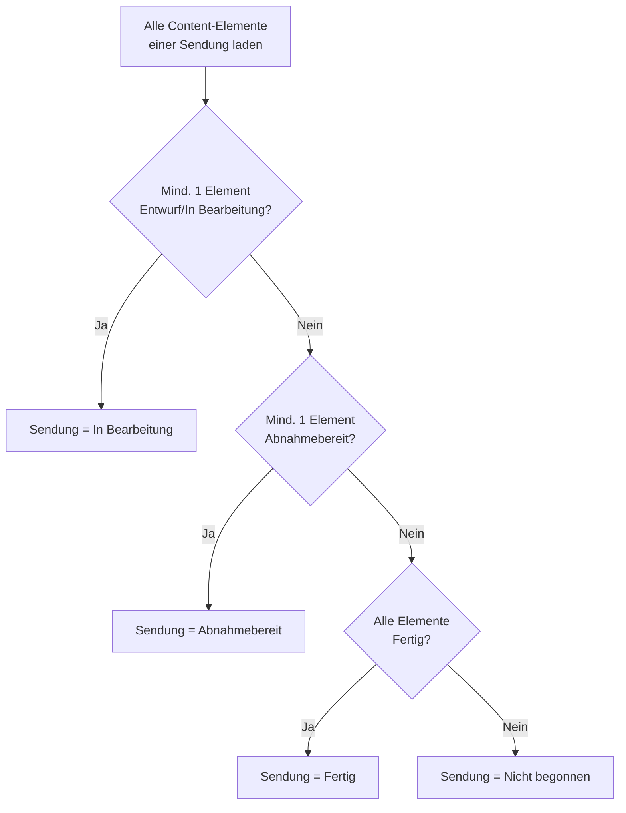
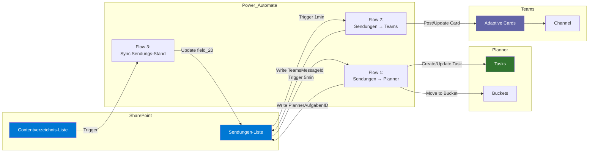

# ARD Stand-Up – Datenmodell

## Entity-Relationship-Diagramm



---

## Beziehungen im Detail

### Sendungen ↔ Contentverzeichnis



**Kardinalität**: 1:n (Eine Sendung hat 0..n Content-Elemente)

**Beziehungsrichtung**:
- **Primär**: `Contentverzeichnis.Folge` → `Sendungen.ID` (Lookup)
- **Reverse**: `Sendungen.ContentElementeLookup` ← `Contentverzeichnis` (LookupMulti)

**Verwendung in Flows**:
- Flow "Sync Sendungs-Stand" aggregiert Status aller Content-Elemente einer Sendung
- Status-Hierarchie: Content → Sendung → Planner

---

### Sendungen ↔ Planner Task



**Kardinalität**: 1:0..1 (Eine Sendung hat max. einen Planner-Task)

**Synchronisation**:
| SharePoint-Feld | Planner-Attribut |
|-----------------|------------------|
| `ID` + `field_5` + `field_9` + `field_2` | `title` |
| `field_2` | `dueDateTime` |
| `field_20` | `bucketId` (via Name-Matching) |
| `ProducerBriefing` + `field_6` + ... | `description` |
| `Scoopa0`, `VideoTitel`, `{Link}` | `references[]` |
| `Logo_x002d_Sendung` | Cover (via references) |

**ID-Rückschreibung**: `Planner.id` → `Sendungen.PlannerAufgabenID`

---

### Sendungen ↔ Teams Message



**Kardinalität**: 1:0..1 (Eine Sendung hat max. eine Teams-Card)

**Bedingungen für Card-Erstellung**:
- `SendeanPlanner = true`
- `AlteSendung != true`

**ID-Rückschreibung**: `Teams.messageId` → `Sendungen.TeamsMessageId`

---

## Status-Aggregation



### Aggregationslogik



---

## Datenfluss-Diagramm



---

## Physisches Modell

### SharePoint Site

```
Site: https://wdr.sharepoint.com/teams/ARDStand-UpO365
│
├── Liste: Sendungen
│   GUID: 08c76ffb-e10b-4158-92b5-73a509a221cc
│   Primärschlüssel: ID (Counter)
│
└── Liste: Contentverzeichnis
    GUID: [unbekannt]
    Primärschlüssel: ID (Counter)
    Fremdschlüssel: Folge → Sendungen.ID
```

### Microsoft 365 Group

```
Group: ARD Stand-Up
GUID: d248cec5-c1d3-4ff5-9063-464b51e94769
│
├── Planner Plan: ARD Stand-Up Sendungen
│   ID: BvxWXWZmdkCDv5ijzP3Lg5YABxSR
│   │
│   └── Buckets:
│       ├── Nicht begonnen
│       ├── In Bearbeitung
│       ├── Abnahmebereit
│       └── Fertig
│
└── Teams Channel: [Producer-Benachrichtigungen]
    ID: 19:3f67cd94e241472aab55708084e3bce8@thread.tacv2
```

---

## Referenzielle Integrität

### Automatisch gewährleistet

| Beziehung | Mechanismus |
|-----------|-------------|
| Contentverzeichnis → Sendungen | SharePoint Lookup (verhindert ungültige FK) |

### Manuell/Flow-gesteuert

| Beziehung | Risiko | Mitigation |
|-----------|--------|------------|
| Sendungen → Planner Task | Task kann in Planner gelöscht werden | Flow prüft Task-Existenz vor Update |
| Sendungen → Teams Message | Message kann gelöscht werden | Flow postet neue Card wenn ID ungültig |

### Orphan-Szenarien

| Szenario | Auswirkung | Empfehlung |
|----------|------------|------------|
| Sendung gelöscht, Content-Elemente bleiben | Verwaiste Elemente | Cascade-Delete via Flow |
| Planner-Task manuell gelöscht | `PlannerAufgabenID` zeigt ins Leere | Flow erstellt neuen Task |
| Teams-Card manuell gelöscht | `TeamsMessageId` zeigt ins Leere | Flow postet neue Card |

---

## Index-Empfehlungen

### Sendungen-Liste

| Feld | Index-Typ | Begründung |
|------|-----------|------------|
| `field_20` | Standard | Häufige Filterung nach Status |
| `SendeanPlanner` | Standard | Trigger-Condition |
| `PlannerAufgabenID` | Standard | Lookup für Updates |
| `TeamsMessageId` | Standard | Lookup für Updates |

### Contentverzeichnis-Liste

| Feld | Index-Typ | Begründung |
|------|-----------|------------|
| `Folge` | Standard | Join mit Sendungen |
| `Bearbeitungsstautus` | Standard | Status-Aggregation |

---

## Datenvolumen-Schätzung

| Entität | Geschätztes Volumen | Wachstum |
|---------|---------------------|----------|
| Sendungen | ~500 aktiv, ~2000 archiviert | +200/Jahr |
| Contentverzeichnis | ~5 pro Sendung = ~2500 aktiv | +1000/Jahr |
| Planner Tasks | = Sendungen (1:1) | +200/Jahr |
| Teams Messages | = aktive Sendungen | +200/Jahr |

**Limitierungen**:
- SharePoint List: 30 Mio. Items (kein Problem)
- Planner Plan: 2400 Tasks (ggf. Archivierung nötig)
- SharePoint View Threshold: 5000 Items (Indizes wichtig)

---

*Dokumentation erstellt: 2026-01-22*
